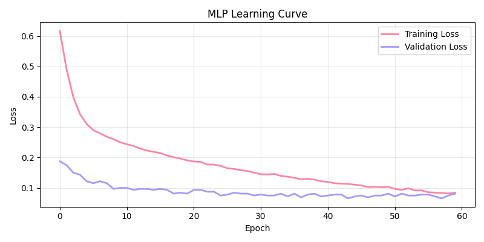
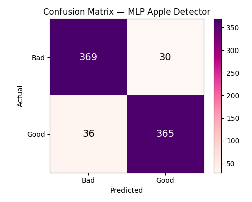
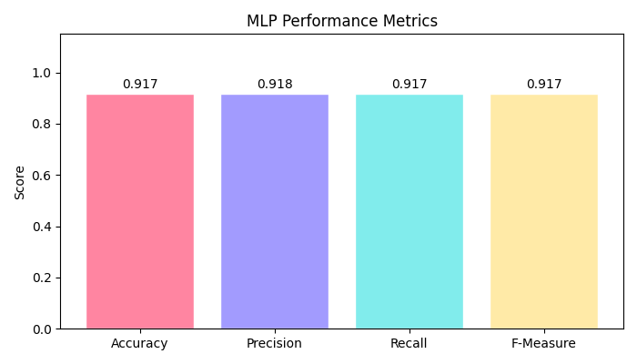
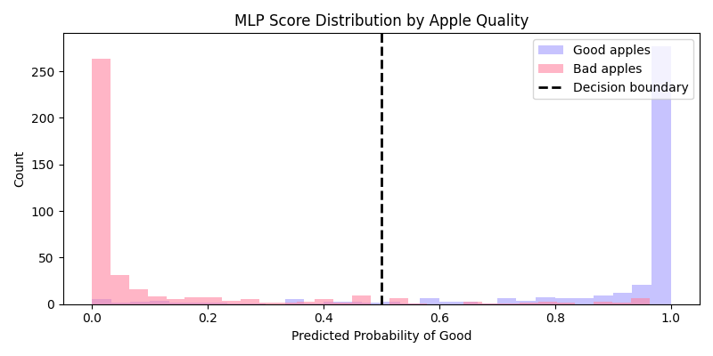

# Apple Quality Detector — Multilayer Perceptron
## Technical Report — MLP Assignment
### Grand Canyon University
#### Ortasele Aisuan
---

## Problem Statement

Identifying bad apples before they reach consumers is a critical quality control challenge for food distributors and retailers. This project applies a Multilayer Perceptron (MLP) neural network to the Apple Quality Dataset to classify apples as good or bad based on seven physical characteristics, Size, Weight, Sweetness, Crunchiness, Juiciness, Ripeness, and Acidity. Unlike the linear Adaline model applied to this dataset previously, the MLP can learn non-linear decision boundaries, enabling significantly higher classification accuracy on this problem.

---

## Algorithm of the Solution

A Multilayer Perceptron is a feedforward neural network consisting of an input layer, one or more hidden layers, and an output layer. Each neuron in a layer receives weighted inputs from the previous layer, applies an activation function, and passes the result forward. The network learns by computing the error between predicted and actual outputs and adjusting weights through backpropagation using gradient descent.

**Pipeline:**
1. Load and clean the Apple Quality Dataset
2. Encode labels: good = 1, bad = 0
3. Subset to seven feature columns
4. Split data 80% training / 20% testing
5. Standardize features using StandardScaler
6. Build MLP with three hidden layers (128 → 64 → 32)
7. Train using Adam optimizer with early stopping
8. Evaluate using precision, recall, and F-measure
9. Generate learning curve, confusion matrix, and performance plots

---

## 1. Load and Preprocess Data

```python
df = pd.read_csv('apple_quality.csv')
df = df.dropna(subset=['Quality'])
df = df[df['Quality'].isin(['good', 'bad'])]
```

**Output:**
```
Dataset shape    : (4000, 9)
Good apples      : 2004
Bad apples       : 1996
Missing values   : 0
```

The dataset contains 4,000 apple samples with a near-perfectly balanced class distribution, 2,004 good and 1,996 bad. No missing values were found after removing the trailing metadata row. The balanced classes mean no oversampling technique is needed.

---

## 2. Subsetting Data

```python
feature_cols = ['Size', 'Weight', 'Sweetness', 'Crunchiness',
                'Juiciness', 'Ripeness', 'Acidity']

X = df[feature_cols].values.astype(float)
y = np.where(df['Quality'].values == 'good', 1, 0)
```

Seven physical measurement features are used as inputs. The target variable is binary, 1 for good and 0 for bad. These same features were used in the prior Adaline assignment, making the results directly comparable.

---

## 3. Splitting Data

```python
X_train, X_test, y_train, y_test = train_test_split(
    X, y, test_size=0.2, random_state=42, stratify=y
)
scaler      = StandardScaler()
X_train_std = scaler.fit_transform(X_train)
X_test_std  = scaler.transform(X_test)
```

**Output:**
```
Training samples : 3200
Test samples     : 800
```

The data is split 80% training and 20% testing with stratification. StandardScaler is applied since MLP training is sensitive to feature scale — features with larger numerical ranges would otherwise dominate the gradient updates during training.

---

## 4. Building the MLP Model

```python
mlp = MLPClassifier(
    hidden_layer_sizes=(128, 64, 32),
    activation='relu',
    solver='adam',
    max_iter=500,
    random_state=42,
    early_stopping=True,
    validation_fraction=0.1,
    n_iter_no_change=15
)
mlp.fit(X_train_std, y_train)
```

**Output:**
```
Architecture  : Input(7) → 128 → 64 → 32 → Output(2)
Activation    : ReLU
Optimizer     : Adam
Epochs trained: 60
Final loss    : 0.0843
```

The MLP has three hidden layers with 128, 64, and 32 neurons respectively. ReLU activation introduces non-linearity at each layer, enabling the network to learn complex patterns in the data. The Adam optimizer adapts the learning rate during training for efficient convergence. Early stopping halts training when validation loss stops improving, preventing overfitting (Raschka, Liu, & Mirjalili, 2022).

---

## 5. Making Predictions

```python
y_train_pred = mlp.predict(X_train_std)
y_test_pred  = mlp.predict(X_test_std)
```

**Output:**
```
Training accuracy : 95.8%
Test accuracy     : 91.8%
Overfitting gap   : 4.1%
```

The model achieves 91.8% test accuracy — a dramatic improvement over the 63.4% achieved by Adaline on the same dataset. The 4.1% gap between training and test accuracy is modest, indicating early stopping successfully limited overfitting.

---

## 6. Classification Results

```python
prec = precision_score(y_test, y_test_pred, average='weighted')
rec  = recall_score(y_test,    y_test_pred, average='weighted')
f1   = f1_score(y_test,        y_test_pred, average='weighted')
```

**Output:**
```
Precision  : 0.918
Recall     : 0.917
F-Measure  : 0.917

Classification Report:
          precision  recall  f1-score  support
bad           0.91    0.92      0.92      399
good          0.92    0.91      0.92      401
accuracy                        0.92      800
```

Precision and recall are balanced across both classes, meaning the model is equally reliable at identifying good apples and bad apples — unlike the Adaline model which strongly favored one class over the other.

---

## 7. Learning Curve



The learning curve shows both training and validation loss decreasing steadily across epochs before leveling off. The curves remain close together throughout training, which confirms the model is not overfitting. Early stopping triggered at epoch 60 when improvement stalled.

---

## 8. Confusion Matrix

```python
cm = confusion_matrix(y_test, y_test_pred)
```

**Output:**
```
True Negative  (bad  → bad)  : 369
False Positive (bad  → good) :  30
False Negative (good → bad)  :  36
True Positive  (good → good) : 365
```



The confusion matrix shows well-balanced performance — 369 bad apples correctly identified and 365 good apples correctly identified. False positives (30) and false negatives (36) are low and roughly equal, which is a significant improvement over the Adaline model that generated 267 false negatives on the same test set.

---

## 9. Performance Metrics and Score Distribution





The metrics bar chart shows accuracy, precision, recall, and F-measure all above 0.91 — consistently strong performance across all evaluation criteria. The score distribution plot shows the predicted probability scores for good and bad apples separating cleanly on either side of the 0.5 decision boundary, with far less overlap than the Adaline score distribution. This visual confirms the MLP has learned a meaningful non-linear decision boundary that Adaline's linear approach could not achieve.

---

## Analysis of Findings

The MLP achieved 91.8% test accuracy on the Apple Quality Dataset, compared to 63.4% with the Adaline model applied to the same data in a prior assignment. This improvement of over 28 percentage points directly demonstrates the advantage of multi-layer neural networks over single-layer linear models  the MLP's three hidden layers with ReLU activations can capture the non-linear relationships between apple characteristics and quality that Adaline cannot represent.

The model's precision (0.918), recall (0.917), and F-measure (0.917) are all high and balanced between the two classes. The early stopping mechanism kept the overfitting gap at 4.1%, indicating the model generalizes well beyond the training data. The score distribution plot confirms clean class separation, meaning the MLP's predicted probabilities are well-calibrated and useful for real-world decision making.

For a production deployment this model would reliably flag bad apples while minimizing waste from incorrectly rejecting good ones — a meaningful improvement over both manual inspection and simpler linear classifiers (Raschka, Liu, & Mirjalili, 2022).

---

## References

Pedregosa, F., Varoquaux, G., Gramfort, A., et al. (2011). Scikit-learn:
    Machine learning in Python. *Journal of Machine Learning Research*,
    12, 2825–2830. 

Raschka, S., Liu, Y., & Mirjalili, V. (2022). *Machine learning with
    PyTorch and Scikit-Learn* (3rd ed.). Packt. ISBN 9781801819312.

Elgiriyewithana, N. (2023). *Apple quality dataset* [Data set]. Kaggle.
   
